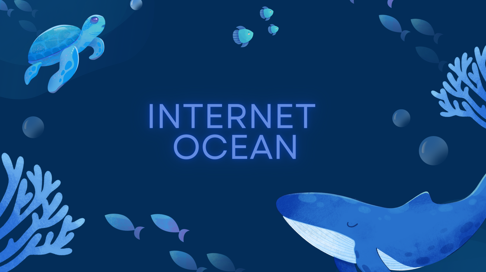

 

  <a href="#objetivo">Objetivo do Projeto </a>  |
  <a href="#tecnologias">Tecnologias </a>  |
  <a href="#sprints">Sprints</a>  |
  <a href="#requisitos">Requisitos do parceiro</a> |
  <a href="#backlog">Product Backlog</a>  | 
  <a href="#equipe">Equipe</a>

 

  
## 🎯 Objetivo do Projeto
O projeto Internet Ocean tem como objetivo realizar o gerenciamento de chamados de forma que aja maior otimização do processo de atendimento e suporte ao cliente, garantindo uma gestão eficiente das demandas. Isso é feito por meio da criação de um sistema com três usuários: cliente, suporte e ADM, fazendo com que exista um acompanhamento detalhado de cada chamado, atribuindo priorização de tarefas e alterando seu andamento.

 

 
## 💻 Tecnologias

          

 

## 🗓 Sprints
[Sprint 1](https://github.com/CoddingWarriors/Api_CoddingWarriors/tree/sprint1): em andamento 🔁   
[Sprint 2](https://github.com/CoddingWarriors/Api_CoddingWarriors/tree/sprint2): em andamento 🔁   
Sprint 3: em andamento 🔁   
Sprint 4: em andamento 🔁 

 

## 🗂 Requisitos do parceiro
| ID | Requisitos funcionais |
| :--: | :----------------: |
| 1 | Cadastros de Usuários, Técnicos, Equipamentos e Horários |
| 2 | Usuários devem ter perfis diferentes (administrador, suporte, cliente) |
| 3 | Registro de chamados |
| 4 | Acompanhamento de chamados (Aberto, Em processo, finalizado e Concluído) |
| 5 | Cadastro de soluções para problemas conhecidos |
| 6 | SLA (Acordo de Nível de Serviço) |
| 7 | Base de conhecimento (FAQ) |

| ID | Requisitos não funcionais |
| :--: | :----------------: |
| 8 | Manual do Usuário (online) |
| 9 | Guia de Instalação |

 

## 📋 Product Backlog
| Rank | Prioridade | User Storie | Estimativa | Sprint | Requisito do Parceiro |
| :----: | :-------: | :--------: | :-------: | :-------: | :-----------------: |
| 1 | Alta | Como cliente, quero poder me cadastrar para utilizar todas as funcionalidades que o site tem a oferecer | 8 | 2 | 1 |
| 2 | Alta | Como cliente, suporte e ADM quero realizar o login da minha conta para acessar o site | 5 | 2 | 1 |
| 3 | Alta | Como cliente, quero abrir um chamado afim de receber suporte para solucionar o meu problema | 9 | 2 | 4 |
| 4 | Alta | Como cliente, quero ter um FAQ onde posso consultar as dúvidas frequentes por categorias para tentar encontrar uma solução para o meu problema mais rapidamente | 4 | 2 | 7 |
| 5 | Alta | Como cliente, suporte e ADM quero redefinir a senha para caso de esquecimento | 6 | 2 | 1 |
| 6 | Alta | Como suporte, quero poder aceitar chamados pendentes para resolver o problema do cliente | 4 | 2 | 4 |
| 7 | Alta | Como suporte, quero poder visualizar chamados pendentes para administrar melhor o tempo de cada solicitação | 2 | 2 | 4 |
| 8 | Alta | Como cliente, quero poder visualizar meus chamados pendentes, em andamento e concluídos para poder acompanhar o andamento da minha solicitação | 2 | 2 | 4 |
| 9 | Alta | Como cliente, suporte e ADM quero poder realizar o logout para encerrar minha seção e proteger meus dados | 5 | 2 | 1 |
| 10 | Alta | Como suporte, quero poder responder aos chamados para atender aos clientes | 4 | 2 | 4 |
| 11 | Alta | Como suporte quero ter uma visualização de chamados concluídos para visualizar todos os chamados já feitos | 3 | 3 | 3 |
| 12 | Alta | Como ADM quero poder cadastrar usuários suporte e ADM para auxiliar no funcionamento do sistema | 7 | 3 | 1 |
| 13 | Alta | Como suporte e ADM quero poder cadastrar dispositivos no sistema para melhor visualização dos status dos equipamentos | 7 | 3 | 1 |
| 14 | Alta | Como cliente, quero visualizar o tempo estimado de solução do chamado para ter conhecimento de quando será finalizado | 5 | 3 | 6 |
| 15 | Média | Como ADM, quero ter um gráfico de chamados concluídos separados por categoria para melhor visualização dos problemas mais recorrentes | 7 | 3 | 3 |
| 16 | Média | Como ADM, quero ter um relatório de chamados inválidos para visualizar o motivo da exclusão | 4 | 3 | 3 |
| 17 | Média | Como suporte, quero poder deletar chamados inválidos para não comprometer o andamento dos outros chamados | 6 | 3 | 6 |
| 18 | Média | Como ADM quero poder definir o horário de serviço de cada suporte para uma melhor administração de serviço | 7 | 4 | 1 |
| 19 | Média | Como cliente quero ter um guia de instalação para conseguir instalar o sistema e o utilizar com exito | 3 | 4 | 9 |
| 20 | Baixa | Como cliente, quero ter um manual do usuário para uma melhor orientação na utilização do sistema | 3 | 4 | 8 |
| 21 | Baixa | Como suporte e ADM quero editar e cadastrar dúvidas recorrentes no FAQ para mantê-lo atualizado | 3 | 4 | 5 |
| 22 | Baixa | Como suporte, cliente e ADM quero poder alterar minhas informações pessoais para manter o sistema atualizado | 3 | 4 | 1 |

 

## 👥 Equipe
|   Foto  |     Nome      |     Função     |     Github     |     Linkedin     |
| :-----: | :-----------: | :------------: | :------------: | :--------------: |
|  | Ivan Suiyama Silva | Scrum Master |  |  | 
|  | Erika Dias Ribeiro | Product Owner |  |  |
|  | Igor Kenzo Miyazaki Sasaki | Desenvolvedor |  |  |
|  | Diogo Palharini | Desenvolvedor |  |  |
|  | Juan Garcia Soares | Desenvolvedor |  |  |
