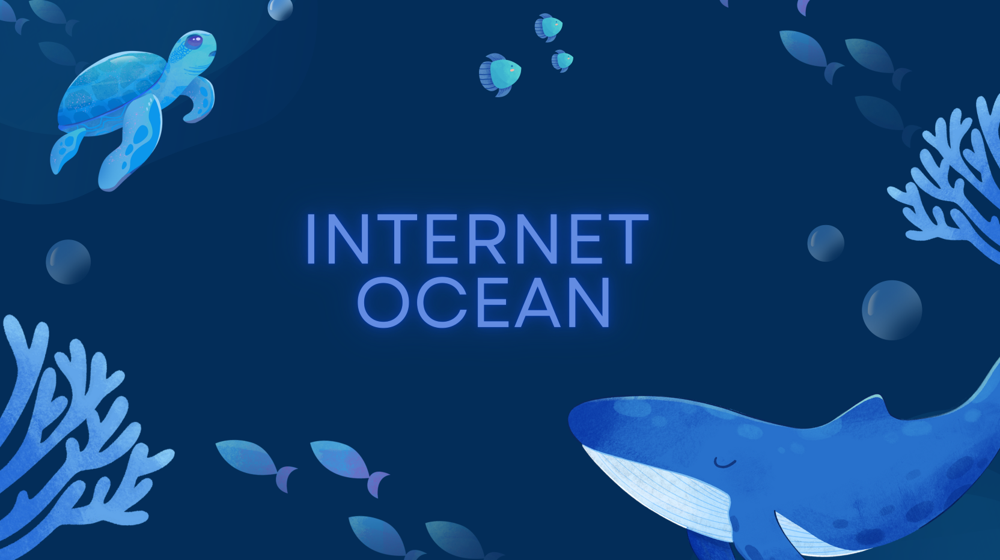

 

  <a href="#objetivo">Objetivo do Projeto </a>  |
  <a href="#tecnologias">Tecnologias </a>  |
  <a href="#sprints">Sprints</a>  |
  <a href="#backlog">Product Backlog</a>  | 
  <a href="#equipe">Equipe</a>  |

 

  
## Objetivo do Projeto
O projeto Internet Ocean tem como objetivo realizar o gerenciamento de chamados de forma que aja maior otimização do processo de atendimento e suporte ao cliente, garantindo uma gestão eficiente das demandas. Isso é feito por meio da criação de um sistema com três usuários: cliente, suporte e ADM, fazendo com que exista um acompanhamento detalhado de cada chamado, atribuindo priorização de tarefas e alterando seu andamento.

 

 
## Tecnologias

          

 

## Sprints
[Sprint 2](): em andamento    
[Sprint 3](): em andamento    
[Sprint 4](): em andamento  

 

## Product Backlog

 

## Equipe
|   Foto  |     Nome      |     Função     |     Github     |     Linkedin     |
| :-----: | :-----------: | :------------: | :------------: | :--------------: |
|  | Ivan          | Scrum Master |  |  | 
|  | Erika Dias Ribeiro | Product Owner |  |  |
|  | Igor | Desenvolvedor |  |  |
|  | Digo Palharini | Desenvolvedor |  |  |
|  | Juan | Desenvolvedor |  |  |
