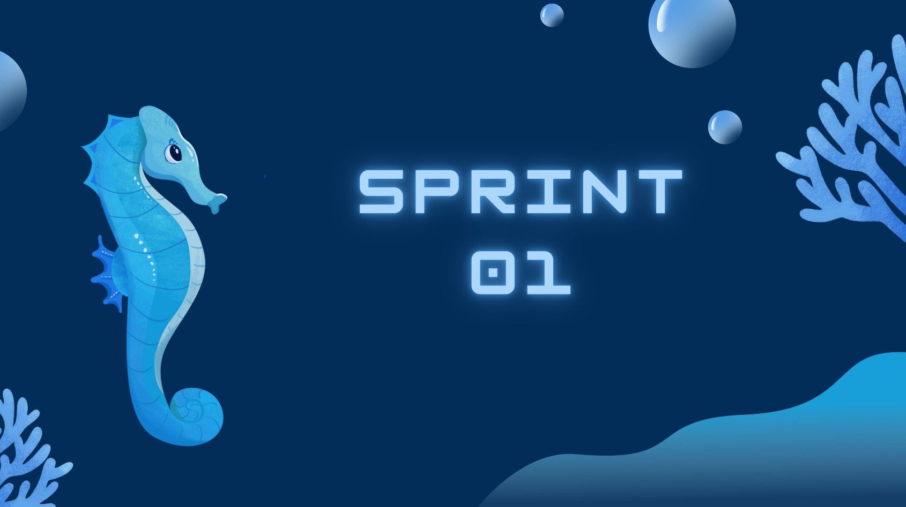
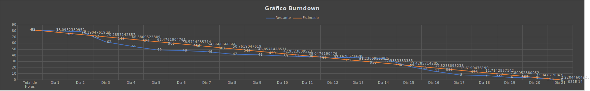

 

  <a href="#objetivo">Objetivo da Sprint </a>  |
  <a href="#dor">DoR</a> |
  <a href="#dod">DoD</a> |
  <a href="#burndown">BurnDown da Sprint</a> |
  <a href="#prototipo">Protótipo navegável</a>

 

  
## 🎯 Objetivo da Sprint
Essa sprint teve como objetivo o desenvolvimento de um protótipo navegável, que após a validação do cliente, será utilizado nas próximas sprints para nos guiar na codificação do sistema. 

 

## 📋 DoR
- User Stories

 

## 📈 DoD
- Protótipo navegável

 

## 📊 BurnDown da Sprint

 

## 🎥 Protótipo navegável
[prototipo-sprint1.webm](https://github.com/CoddingWarriors/Api_CoddingWarriors/assets/113473466/82066a6f-111f-474d-adf4-79ccf87bc3f9)

> O vídeo acima demonstra o atendimento na visão do usuário cliente. Para uma visualização completa do protótipo [clique aqui](https://www.figma.com/proto/H1UFQBlcQEzk4LInxteXoA/API-2024%2F1?type=design&node-id=155-335&t=usI0nsdHk8zismbg-0&scaling=scale-down&page-id=0%3A1&starting-point-node-id=119%3A449&show-proto-sidebar=1)
