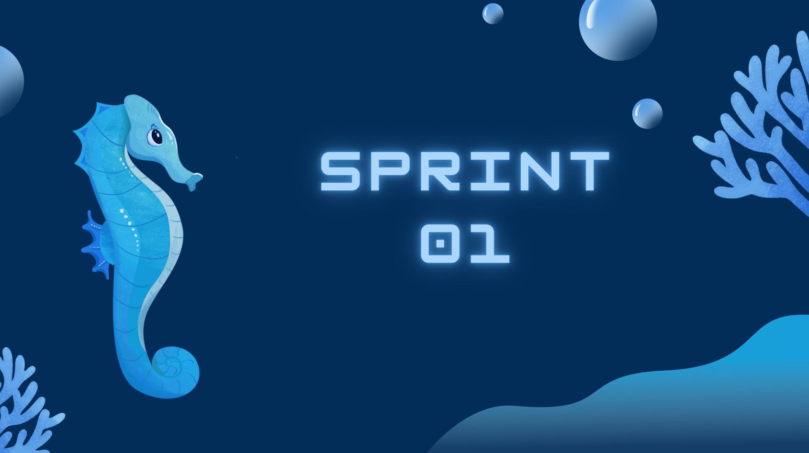

 

  <a href="#objetivo">Objetivo da Sprint </a>  |
  <a href="dor">DoR</a> |
  <a href="dod">DoD</a> |
  <a href="burndown">BurnDown da Sprint</a> |
  <a href="#prototipo">Protótipo navegável</a>

 

  
## 🎯 Objetivo da Sprint
Essa sprint teve como objetivo o desenvolvimento de um protótipo navegável.

 

## 📋 DoR
- Product Backlog

 

## 📈 DoD
- Protótipo navegável

 

## 📊 BurnDown da Sprint

 

## Protótipo navegável
