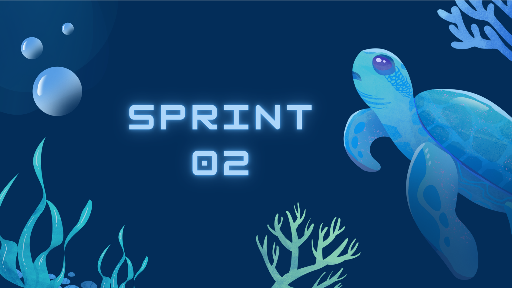

 

  <a href="#objetivo">Objetivo da Sprint </a>  |
  <a href="dor">DoR</a> |
  <a href="dod">DoD</a> |
  <a href="#backlog">Sprint Backlog</a>

 

  
## Objetivo da Sprint
Essa sprint terá como objetivo a criação de chamados pelo usuário cliente, sendo possível o usuário suporte visualizar os pedidos criados e assim os responder, finalizando o atendimento do chamado e o concluindo.

 

## DoR
- User Stories
- Mockup
- Tarefas
- Modelo do banco de dados

 

## DoD
- Código
- Vídeo utilizando o sistema

 

## Sprint Backlog
| User Storie | Estimativa (horas) | Critério de aceitação | Tarefas |
| :---------: | :----------------: | :-------------------: | :-----: |
| Como cliente, quero poder me cadastrar para utilizar todas as funcionalidades que o site tem a oferecer | 6 | [front] Efetuar cadastro informando seus dados pessoais   [front] Exibição de um pop-up de cadastro concluído   [front] Exibição da tela de login   [back] Usuário criado no banco | [front] Tela de cadastro (cliente) – formulário   [back] Cadastro (cliente) – validar os dados   [back] Cadastro (cliente) – criar persistência dos dados no banco |
| Como cliente, suporte e ADM quero realizar o login da minha conta para acessar o site | 5 | [front] Efetuar login utilizando e-mail ou CPF já cadastrados no banco pelo formulário de cadastro   [front] Exibição de um pop-up de login concluído   [front] Exibição da tela principal | [front] Tela de login (cliente, suporte, ADM) - formulário   [back] Login (cliente, suporte, ADM) - validar os formulários |
| Como cliente, quero abrir um chamado afim de receber suporte para solucionar o meu problema | 8 | [front] Efetuar a abertura do chamado informando problemas fictícios   [front] Exibição de um pop-up de chamado realizado   [front] Exibição da tela de atendimento   [back] Chamado criado no banco | [front] Tela de abrir chamado (cliente) - formulário   [back] Abrir chamado (cliente) - validar os dados   [back] Abrir chamado (cliente) - criar persistência dos dados no banco |
| Como cliente, quero ter um FAQ onde posso consultar as dúvidas frequentes por categorias para tentar encontrar uma solução para o meu problema mais rapidamente | 3 | [front] Visualização das perguntas e respostas do FAQ | [front] Tela do FAQ (cliente) |
| Como cliente, suporte e ADM quero redefinir a senha para caso de esquecimento | 7 | [front] Exibição da tela para pedir o e-mail   [front] Acessar o link de e-mail para mudar a senha   [front] Exibição da tela informando que a senha foi alterada com sucesso   [back] E-mail é enviado para o cliente | [front] Tela de redefinir senha (cliente, suporte, ADM)   [back] Redefinir senha (cliente, suporte, ADM) - encaminhar para o e-mail o link para redefinir senha |
| Como suporte, quero poder aceitar chamados pendentes para resolver o problema do cliente | 7 | [front] Selecionar um chamado para mais detalhes   [front] Enviar a resposta do chamado selecionado com templates ou uma nova resposta   [front] Exibição do pop-up de chamado respondido   [front] Exibição da tela de chamados   [back] Resposta criada no banco | [front] Tela de chamados (suporte)   [back] Chamados (suporte) - função onclick() para alteração de status   [back] Chamados (suporte) - validar a alteração   [back] Chamados (suporte) - alterar o status do chamdo no banco |
| Como suporte, quero poder visualizar chamados pendentes para administrar melhor o tempo de cada solicitação | 6 | [front] Exibição apenas dos chamados pendentes | [front] Tela de chamados (suporte)   [back] Chamados (suporte) - encaminhar os dados do banco para tela   [back] Chamados (suporte) - filtar os dados por pendentes |
| Como cliente, quero poder visualizar meus chamados pendentes, em andamento e concluídos para poder acompanhar o andamento da minha solicitação | 6 | [front] Exibição dos chamados agrupados em categoria (pendentes, em andamente, concluído) | [front] Tela de atendimento (cliente)   [back] Atendimento (cliente) - encaminhar os dados do banco para tela   [back] Atendimento (cliente) - filtrar os dados por pendentes, em andamento e concluídos |
| Como cliente, suporte e ADM quero poder realizar o logout para encerrar minha seção e proteger meus dados | 5 |  | [front] Pop-up de logout (cliente, suporte, ADM)   [back] Logout (cliente, suporte, ADM) - invalidar a sessão atual do usuário |
| Como suporte, quero poder responder aos chamados para atender aos clientes | 5 |  | [front] Tela de responder chamados (suporte) - formulário   [back] Responder chamados (suporte) - validar dados   [back] Responder chamados (suporte) - criar permanência da resposta no banco |
